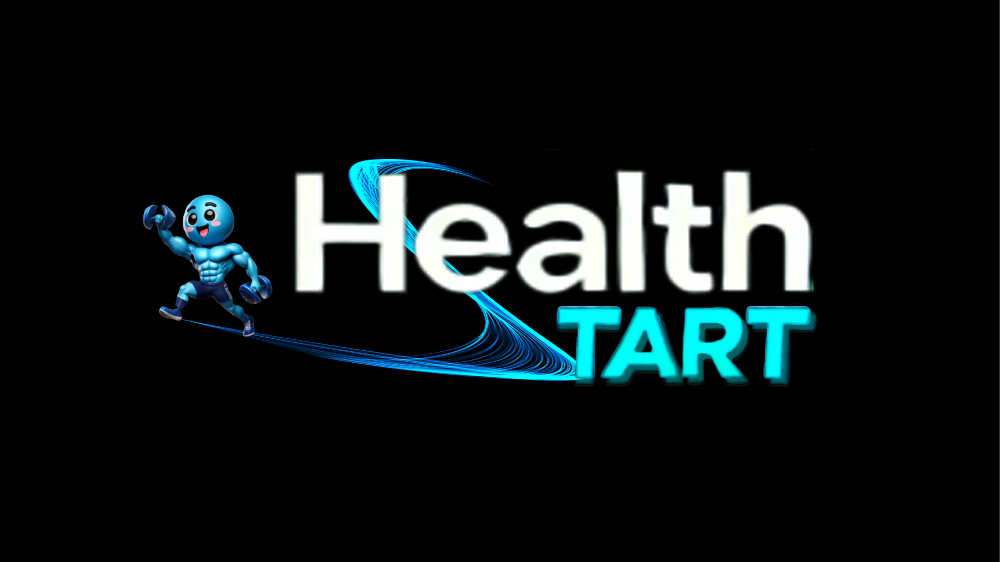

# 🏋️ 헬스타트 _ Healthtart

 
 

# 🐼 Group 4 Team Member - `Dev5oops`

|  |  |  |  |  | 
| :----------------------------------------------------------: | :----------------------------------------------------------: | :----------------------------------------------------------: | :----------------------------------------------------------: | :----------------------------------------------------------: |
|                            조제훈                            |                            백경석                            |                            유제은                            |                            이나현                            |                            이서현                            |
|   ` ESFJ `|   ` ENTP `|   ` INFP `|   ` ENTJ `|   ` INFJ `|

  

# 🛠️ Technical Stack
## 🎨 Frontend

## ⚙️ Backend

 

## 💽 DB
<!---->

<!--  -->
<!--!-->

<!-- ## ⛓️‍💥 Server
 -->

## 💾 DevOps

<!--  -->

## ⚙ Tool
 &nbsp; 
 &nbsp; 
 &nbsp; 
&nbsp; 
 &nbsp;  
 &nbsp; 
 &nbsp; 
 &nbsp; 

## 📡 API
 &nbsp; 
 &nbsp; 
 &nbsp; 
 &nbsp; 

  

#  🚩 프로젝트 개요
### [🔗 위키 바로가기](https://github.com/Dev5Oops/Healthtart/wiki/1.-%ED%94%84%EB%A1%9C%EC%A0%9D%ED%8A%B8-%EA%B0%9C%EC%9A%94)

  

# 🚩 기획 문서
### [🔗 위키 바로가기](https://github.com/Dev5Oops/Healthtart/wiki/2.-%EA%B8%B0%ED%9A%8D-%EB%AC%B8%EC%84%9C)

  

# 🚩 DDD (Domain Driven Design) 설계
### [🔗 위키 바로가기](https://github.com/Dev5Oops/Healthtart/wiki/3.-DDD-(Domain-Driven-Design))

  

# 🚩 DB모델링
### [🔗 위키 바로가기](https://github.com/Dev5Oops/Healthtart/wiki/4.-DB-%EB%AA%A8%EB%8D%B8%EB%A7%81)

  

# 🚩UI 디자인 (Figma)
### [🔗 위키 바로가기](https://github.com/Dev5Oops/Healthtart/wiki/5.-UI-%EB%94%94%EC%9E%90%EC%9D%B8-(Figma))

  

# 🚩 API Test
### [🔗 위키 바로가기](https://github.com/Dev5Oops/Healthtart/wiki/6.-API-%EB%AA%85%EC%84%B8%EC%84%9C)

  

# 🚩 기능 테스트
### [🔗 위키 바로가기](https://github.com/Dev5Oops/Healthtart/wiki/7.-%EA%B8%B0%EB%8A%A5-%EC%8B%9C%EC%97%B0)

  

# 🚩 Jenkins

### [🔗 위키 바로가기](https://github.com/Dev5Oops/Healthtart/wiki/8.-CICD)

  

# 📜 동료평가

**1. 조제훈**

|Team Member| 동료평가 |
| :--------------------------------------: | ------ |
|  백경석  | spring security의 강도높은 난이도 덕에 허덕여 맡은 기능 구현할 시간이 부족했으나 정확도, 빠르기를 둘다 겸비한 조제훈 친구는 제가 맡은 기능을 대신 구현해주어 security를 구현해낼 수 있었습니다.  |
|  유제은  | 이 친구는 프로젝트의 아하포인트가 될 수 있는 부분을 맡아서 해준 친구 입니다. 여러 이슈로 시간이 많이 부족했음에도 뛰어난 실력으로 다해내는 모습이 경이로웠습니다. 제가 어려워서 잘 하지 못하는 부분을 '로그를 찍어가면서 차근차근 하면 해결할 수 있을거다.'라며 제가 직접 해결할 수 있도록 해결책을 주는 팀원을 강하게 키우는 팀원입니다. ㅎㅎ |
|  이나현  | 새로운 기능임에도 불구하고 끈기와 열정은 역시 남달랐다.. 항상 주저하지 않고 도움이 필요하면 먼저 손을 내밀어 주는것이 장기 팀을 유지할 수 있는 비결이 아닌가 싶다. 침착함을 잃지 않아 개발하면서 화날때 도로 진정이 되는 기분이라 힘이 항상 돌아온다. 수고많았어요 ><|
|  이서현  | 새로운 기능인 OCR 인식을 하느라 정말 고생이 많았다. 그리고 발표 직전에 엉망이 된 코드를 커버하는 엄청난 발표 실력에 감동을 받았다. |

**2. 백경석**

|Team Member| 동료평가 |
| :--------------------------------------: | ------ |
|  조제훈  | user 관련 oauth2.0 기술에 대해 많이 공부하여 이전 프로젝트보다 더욱 퀄리티 있는 코드로 구현해냈습니다. 그리고 도커로 하는 배포에 대해 많이 공부하여 이전 프로젝트보다 훨씬 많은 기여를 해내주었습니다. |
|  유제은  | 시큐리티, 로그인, 도커... 또 뭐더라...그냥 안한게 없는 다재다능 옴므파탈 끈기대마왕 정리머신 책임만땅 보이 입니다. 프로젝트 시작할때부터 시큐리티를 먼저 하겠다고 하며 서현이언니와 새벽까지 열심히 하는 모습을 보고 저도 자극 받았습니다. 시간이 지날수록 점점 더 열심히 하는 모습이 보기 좋습니다!! 항상 "성장했다..."를 입에 달고사는 경석이는 과연 다음 프로젝트때 얼마나 더 성장할지 기대가 됩니다. 이번에는 하루 밤을 샜는데 그땐 며칠을 새려고 그럴까요? |
|  이나현  | 역시 성장몬은 다르다고 느꼈다. 어려움이 닥치면 절대 외면하지않고 해결해내는 모습과 끈기가 보기 좋아 덩달아 열심히 하게되는 팀 분위기 이끌어 나가준다. 나중에 유저부분을 경석성장몬에게 가르침을 받을 예정이며, 앞으로도 같이 화이팅 할거다. 그럴거지 성장몬? 수고 많아따잉?|
|  이서현  | 함께 시큐리티 부분을 맡았는데 어려워서 헤메는 나를 계속 도와주어서 정말 고마웠다. 덕분에 이번 프로젝트도 무사히 끝낼 수 있었다. 그리고 CICD도 맡아서 해주어서 마지막까지 프로젝트를 잘 완료할 수 있었다. |

**3. 유제은**

|Team Member| 동료평가 |
| :--------------------------------------: | ------ |
|  조제훈  | 우리의 주요 기능이라고 할 수 있는 GPT API의 프롬프팅을 통해 데이터 생성을 하는 것이 어려웠을만도 한데 열심히 참여해주었습니다. 다음 프로젝트에도 같이 하게 되었는데 최종 프로젝트 때는 많은 기여를 할 수 있을 것 같습니다! |
|  백경석  | 밋밋했던 저희 서비스를 open ai를 사용하여 지피티를 활용해서 아하 포인트를 잡아준 친구입니다. 항상 열심히며 잠을 줄여서라도 기능을 완성해내는 모습이 인상깊었습니다. |
|  이나현  | 정말.. 하나를 알면 둘을 아는 언니야다. 같은 기능 부분을 맡았는데 , 협업이 너무 잘되어서 어려움이 있어도 웃으면서 같이 극복해 나갈 수 있었던것 같다. 인간 지피티가 되는 모습을 보고 언니가 잠깐 ai인가 생각이 들정도로 몰입이 높고, 본받고싶을 정도의 책임감을 또 다시 느꼈다. 마지막에 위경련이 와도 .... 끝까지 함께한 유 제 은 . 수고 많았다.. >< |
|  이서현  | 나현이와 함께 이번 프로젝트에도 핵심핵심 기능이자 어려운 기능을 맡아 최선을 다해주었다. 비록 프롬프팅을 하다가 미쳐버리긴 했지만 덕분에 우리의 핵심 기능 중 하나를 완성할 수 있었다. |

**4. 이나현**

|Team Member| 동료평가 |
| :--------------------------------------: | ------ |
|  조제훈  | 우리의 주요 기능이라고 할 수 있는 GPT API의 프롬프팅을 유제은 팀원과 함께 많이 기여하였습니다. 좀 더 기능 개발하는 흐름에 대해 감을 잡는다면 엄청난 속도로 발전할 수 있을 것 같은 잠재력을 가진 팀원입니다. |
|  백경석  | 유제은 친구와 더불어 open ai를 활용해 더욱 심화된 프로젝트를 만들어 냈습니다. 뿐만 아니라 db 테이블의 구조의 문제점을 사전에 짚어내 리팩토링하는 시간을 절약할 수 있었습니다. |
|  유제은  | 디자인장인, 계획은나에게로인간플래너 입니다. 자격증 시험 기간이었음에도 불구하고 맡은 기능을 해내기위해 밤새는 모습이 보기 좋았습니다. 해야할 일을 착착 정리해서 가져와주고 예시자료도 찾아주고 프로젝트를 원활히 진행하는데에 도움을 준 친구입니다. 제가 의문을 가지면 해결해주기위해 1시간의 건전한 토론도 해줍니다. 덕분에 왜 그렇게 진행해야하는지에 대한 이해를 더 쉽게 하도록 도와주었습니다 ㅎㅎㅎ |
|  이서현  | 제은이와 함께 또 어려운 핵심 기능을 맡아 고생이 너무 많았다. 비록 정처기 시험 기간이었지만 열심히 프로젝트와 공부를 병행하는 모습이 아름다웠다. |

**5. 이서현**

|Team Member| 동료평가 |
| :--------------------------------------: | ------ |
|  조제훈  | 백경석 팀원과 함께 user 서비스 관련하여 다뤄보고 싶다는 열정을 보이며 열심히 참여해준 팀원입니다. 이전 프로젝트 때는 CRUD 에서 그쳤다면 이번엔 더욱 심도 깊은 기술을 사용하기 위해 노력하는 모습이 멋졌습니다. |
|  백경석  | 저와 같이 유저 서비스를 구현했습니다. OAuth2에 대한 이해와 spring security에 대한 열띤 토론은 이해가 더 잘되게 만들어줬고 혼자 했다면 해내지 못했을 유저서비스를 구현할 수 있어 좋았습니다. |
|  유제은  | 잘 모르지만 해보겠다는 도전정신에 박수를 쳐주고 싶습니다. 상대적으로 체력이 딸리는 우리언니...체력 2 남을때까지 프로젝트하다가 방전 직전에 자러가는 우리언니...힘들면 산책하고 와서라도 잠깨고오는 우리언니입니다. 모델링을 잘해서 저도 모르게 '언니 이부분은 이렇게 하는게 맞지않을까?' 하고 제일 먼저 찾게됩니다. |
|  이나현  | 먼저 구현하고싶은 기능을 나서서 맡아주는 모습보고 반했다.. 하지만 언니가 건강했으면 좋겠다.... 역시 마지막까지 문서화는 이서현을 그 누구도 따라갈 수 없다고 생각이 다시한번 들었다. 하지만 건강은 같이 챙겼으면 하는 바램이다. 너무 수고많았어엉 ?? |

